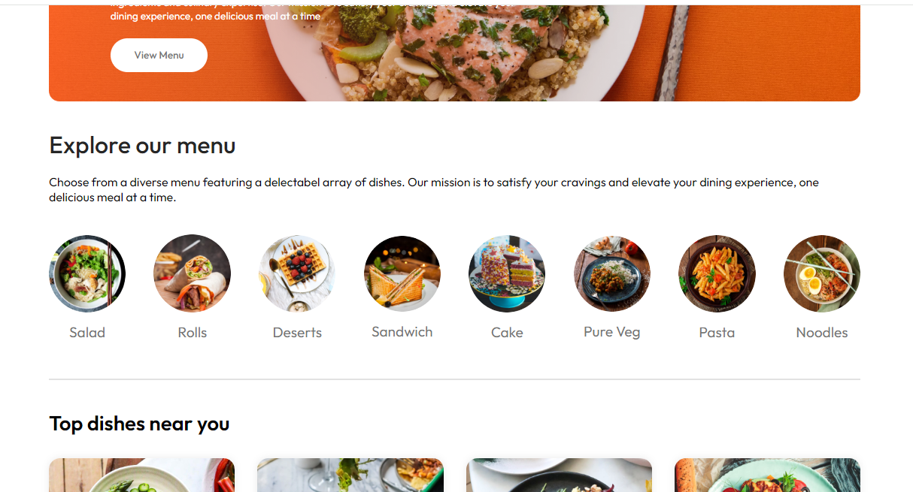
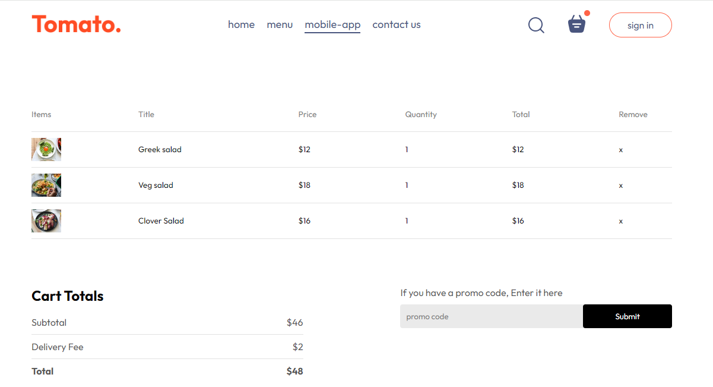
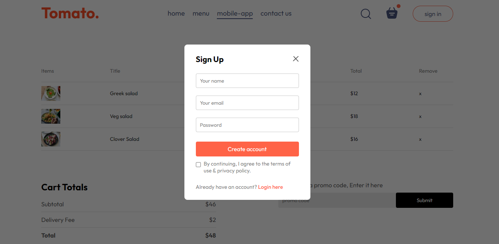
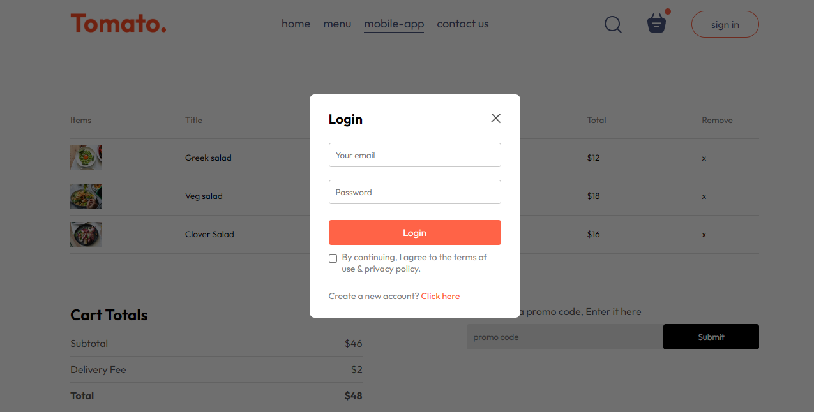

# Tomato Food Website

Tomato is a React-based food website project created by Sandeep Kumar. It provides a platform to explore delicious dishes, order food via website, and manage orders conveniently. The website is built using ReactJS, HTML, CSS, and JavaScript.

## Deployment

The website is currently deployed and accessible at: [Tomato Website](https://tomatoz.netlify.app)

## Features

- Displays top dishes and latest offers on the home page.
- Browse through the menu to discover various food options.
- Download the mobile app for easy ordering on the go.
- View and manage items in the cart before placing an order.
- Sign up to access exclusive deals and promotions.
- Login to your account to continue with your orders.

## Technologies Used

- ReactJS
- HTML
- CSS
- JavaScript

## Pages

1. **Home**: Discover top dishes and latest offers.
2. **Menu**: Browse through various food options.
3. **Mobile App**: Download the mobile app for easy ordering.
4. **Cart**: View and manage items in your cart.
5. **Sign Up**: Create an account to access exclusive deals.
6. **Login**: Log in to continue with your orders.

## Website Screenshots

### Home

### Menu

### Mobile App

### Cart

### Sign Up

### Login

## Author

Sandeep Kumar

## Getting Started

To run the Tomato Food Website project locally, follow these steps:

1. Clone this repository: `git clone https://github.com/Sandykr29/Tomato.git`
2. Navigate to the project directory: `cd tomato`
3. Install dependencies: `npm install`
4. Start the development server: `npm start`
5. Open your browser and visit: [http://localhost:3000](http://localhost:3000)

## Contributing

Contributions are welcome! If you find any issues or have suggestions for improvements, please feel free to open an issue or submit a pull request.
